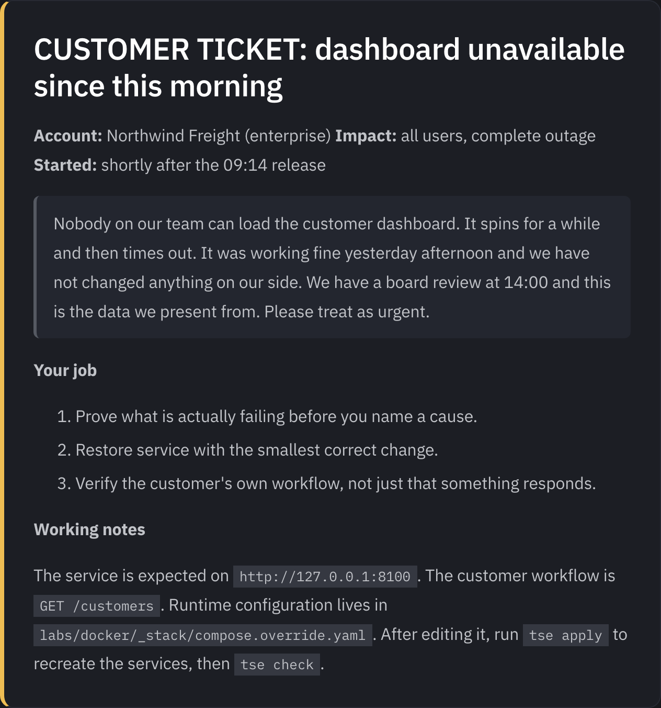
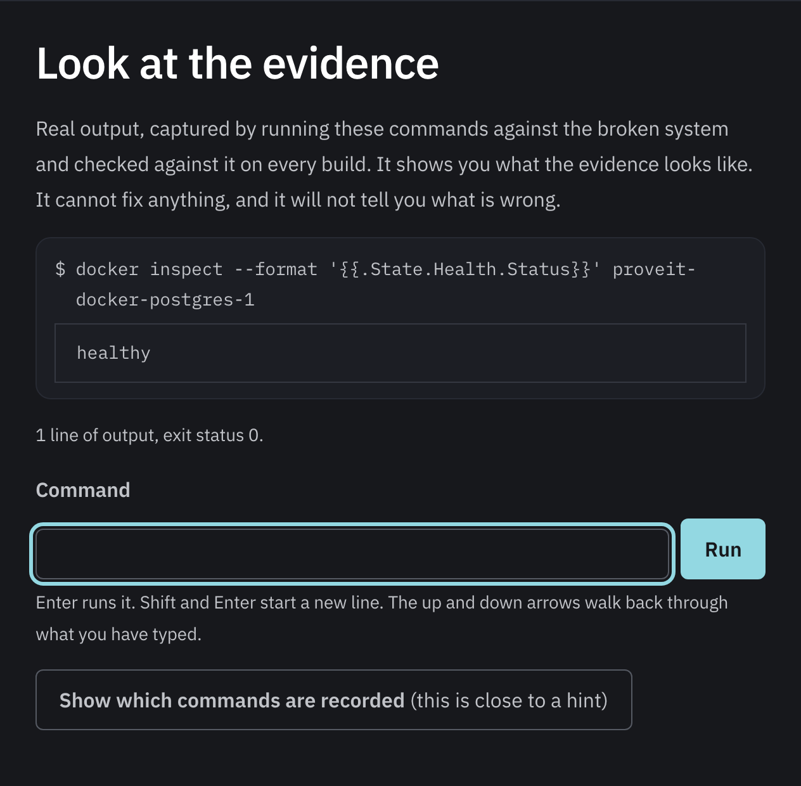

# Prove It

[](https://github.com/h-vance/prove-it-labs/actions/workflows/verify.yml)
[](https://github.com/h-vance/prove-it-labs/actions/workflows/site.yml)
[](https://github.com/h-vance/prove-it-labs/actions/workflows/security.yml)
[](LICENSES/)


A hands-on Technical Support Engineering course. You get a customer ticket, a
genuinely broken system, and no hint about which layer failed. You investigate.

**The course site is at [h-vance.github.io/prove-it-labs](https://h-vance.github.io/prove-it-labs/).**
Every exercise page there is generated from the exercise itself, and carries a
terminal replaying output captured by really running those commands.

**You get the ticket, and nothing else.** No topic, no layer, no hint about
where the fault is. That is the one thing a real ticket never gives you.



**The terminal on the page replays real output.** These are not invented
strings. Each one was captured by running that command against the broken
system, and CI re-runs every one of them against a freshly provisioned stack on
every push, so a byte of drift fails the build rather than quietly misleading
somebody.



That screenshot is worth a second look. The database is **healthy**, and the
customer still cannot load anything. Learning to say what that proves, and just
as importantly what it does not, is the whole course.

Regenerate the images with `npm run screenshots`, which drives the built site in
a real browser. They are scripted rather than captured by hand for the same
reason the recordings are: a picture of a user interface is a claim about it,
and one nothing can reproduce goes stale without telling anybody.

Most infrastructure courses tell you the topic before the exercise, which is the
one thing a real ticket never does. Every ticket here is a symptom in the
customer's own words. Working out what to look at first is the skill.

**The site keeps a record of what you can prove.** Every exercise asks one
question, and [the proof page](https://h-vance.github.io/prove-it-labs/proof)
shows which of them you have answered. Nothing done on the site counts: reading
a hint or answering a question is not proof of anything, because nothing typed
into a page fixes a system. Paste the output of `tse progress --json` and the
questions you actually solved turn into statements. It stays in your browser,
there is no account, and nothing is uploaded.

## Start

Open the repository in a Codespace, wait for the container to build, then:

```bash
tse start docker/01
```

That provisions a broken system and prints the ticket. Investigate it with
ordinary tools. When you think you have fixed it:

```bash
tse check
```

The grader never just says pass or fail. It shows the assertion, the command it
ran, and the raw output it evaluated:

```
FAIL  Customer workflow returns their data
      $ curl -s --max-time 3 http://127.0.0.1:8100/customers
      (no output)
      Expected: {"status": "ok", "customer_count": 10} from /customers
```

Running locally instead of in a Codespace needs Docker, `curl`, and
Python 3.9 or newer, which on a Mac means the one already there. Two tracks
want a little more: Kubernetes needs `kubectl` and `kind`, and the API and
observability tracks need `jq`. Nothing else, and nothing to build.

`tse doctor` is the list, grouped by what needs what, so a gap costs you one
track rather than leaving you guessing:

```bash
tse doctor
```

That is deliberately the only copy of the list. A requirements table written
out here as well would be a second thing to keep true, and this README has
already claimed a Python version it did not need and an exercise count nobody
checked. A test fails the build if `tse doctor` learns to require something
these paragraphs never mention.

## The commands

| Command | What it does |
|---|---|
| `tse list` | Every exercise, with time estimates and your progress |
| `tse start <id>` | Provision an exercise and print its ticket |
| `tse check` | Grade the active exercise, showing the evidence used |
| `tse hint` | Reveal the next hint. They escalate rather than dump |
| `tse answer` | Root cause, customer update, and escalation wording |
| `tse apply` | Recreate the services after you edit the configuration |
| `tse reset` | Return to the state described in the ticket |
| `tse quiz` | Answer the exercise's questions and see why |
| `tse progress` | See your progress, or export it for the site's proof record |
| `tse doctor` | Check this machine can run the labs |
| `tse record` | Capture real output for the site's terminal |
| `tse leaks` | Scan committed files for anything from a real machine |
| `tse new` | Scaffold a new exercise |

## How the exercises work

Everything is built around one question, borrowed from how infrastructure
support actually happens:

> What can I prove for the customer right now?

Not "what technology am I studying today." Each exercise proves exactly one
operational fact, and the technology sits underneath it. You are not asked to
memorize commands. You are asked to say what a command proved, and just as
importantly, what it did not.

Every exercise has the same shape, so there is never a surprise about where to
look:

```
ticket.md       the customer symptom, and nothing else
setup/          the broken state
check.sh        the assertions, and the evidence behind them
hints/          three escalating nudges
solution.md     root cause, the fix, and the words you would send
questions.json  three questions on what the evidence proved
commands.txt    the commands worth replaying on the site
transcript.json their real output, captured and re-verified in CI
```

## The terminal on the site is a replay, not a shell

Every exercise page carries a terminal you can type into. It replays output
captured by genuinely running those commands against the broken system, and CI
re-runs all of them against a freshly provisioned stack on every push. If a byte
of the evidence has moved, the build fails rather than the page quietly showing
something that is no longer true.

It will not replay `tse check`, `tse hint` or `tse answer`. The first two are
obvious; the third is the interesting one, because `tse check` states the
expected fixed state in order to assert it, so recording that would hand over
the diagnosis through the back door. Commands that were never recorded are told
so plainly rather than given invented output.

Nothing typed into a page can finish an exercise. That still means changing a
real system.

## Design notes

This course was built for people who bounce off setup friction and walls of
prose, which includes a lot of very good engineers.

- **Uniform structure.** Every exercise is laid out identically, so orienting
  yourself costs nothing.
- **Stated cost.** Every exercise declares how long it takes before you start.
- **A minimum viable day exists.** One ticket, one command, one proof sentence,
  one question answered. That counts as a day of progress.
- **The writing is graded.** Support is half communication, so customer updates
  and escalation notes are assessed work, not an afterthought.

## Tracks

| Track | Exercises | Status |
|---|---|---|
| Docker | 3 | Available |
| APIs | 4 | Available |
| Kubernetes | 5 | Available |
| SQL and PostgreSQL | 3 | Available |
| Mixed incidents | 2 | Available |
| Customer communication | 2 | Available |
| Linux and CLI | 2 | Available |
| Networking, DNS, TLS | 2 | Available, both on TLS so far |
| Observability | 2 | Available |

Twenty-five exercises across all nine tracks. Everything from here is depth
inside tracks that already exist rather than new ground.

Some exercises are built as pairs on purpose. `docker/02` and `docker/03`
present the customer with the same symptom and resolve to different causes, as
do `kubernetes/04` and `kubernetes/05`. In each pair the second ticket has the
customer confidently rule out the previous cause, and be right to. Learning a
fix rather than a method is the failure mode this course is trying to prevent.

The networking pair goes one step further: `networking/02` is caused by the fix
for `networking/01`. Both failures print the same exit code and the same closing
paragraph, one line apart, and the second ticket arrives a week after the first
looking like an unrelated migration problem.

**Mixed incidents work differently.** In every other track the folder tells you
where to look before you have read a word. There, it does not: the ticket names
no technology and no layer, and working out which system is even involved is
the first real step. Both of the current pair share a theme, which is the one
worth carrying into a real rotation: a signal that is green, accurate, and
answering a narrower question than the customer asked.

**Observability is about the reading you did not take.** Neither exercise there
has anything broken in the usual sense. In the first, the service is healthy,
the dashboard is accurate, and a customer is completely unable to work, all at
the same time and all provable from the same endpoint. In the second, every
service is running, no log is empty, and every line carries a perfectly good
reference. They just do not join up, so three support engineers in a row
concluded that a customer's evidence did not exist.

**Customer communication is graded on what you write.** There is no system to
bring up. You get the evidence from an incident you already solved and a draft
somebody else did badly, and `tse check` runs a rubric over your rewrite: does
it state impact in the customer's terms, cite a figure, name something ruled
out, end by committing somebody to something. The two exercises are graded on
nearly opposite rules, because a customer update fails for naming internal
machinery and an escalation fails for leaving it out.

The rubric checks only what a machine can honestly check, then prints a short
tone checklist you score yourself, prefaced by the admission that no linter can
tell whether a sentence sounds like a person wrote it. Claiming otherwise would
make a passing grade worth less, not more.

The Kubernetes track needs a cluster. `tse` creates and reuses one for you:

```bash
tse cluster up       # once, takes about a minute
tse cluster status
tse cluster down
```

## Verification

Every exercise is asserted in CI to **fail in its broken state and pass against
its documented solution**. An exercise that passes while broken is not broken,
and one that fails when fixed is not solvable, so both halves are checked.

```bash
tools/tse verify                # every exercise, both states
tools/tse verify docker/02      # one exercise
tools/tests/smoke.sh            # the CLI surface and the full learner loop
tools/tests/smoke.sh --fast     # skip the parts that need Docker
python3 tools/tests/test_meta.py
python3 tools/tests/test_content.py
```

`test_content.py` enforces the editorial rules mechanically, including the one
that matters most: a ticket that names the failing layer fails the build.

One command runs all of it, and it is the one to run before opening a pull
request:

```bash
tools/tests/preflight.sh
```

**[AUDIT.md](AUDIT.md) is the end-to-end review of this repository**: what was
found, how each finding was proven, the gate that now holds it, and the defect
that gate was planted against before it was trusted. It also records the four
places the audit itself was wrong, because the method is that a gate nobody has
seen fail is not a gate, and that applies to the person applying it.

## The site

The course site is an Astro Starlight build in [`site/`](site). Exercise pages
are **generated from the labs**, so a page cannot drift from the exercise it
documents and adding an exercise needs no site change at all.

```bash
cd site
npm install
npm run dev           # http://localhost:4321/prove-it-labs
npm run build
npm run check:pages    # every exercise has a complete page, inside its weight budget
npm run check:terminal # the terminal replays what was actually recorded
npm run a11y           # WCAG 2.2 AA, every page, light and dark
```

The accessibility gate is a gate, not a report: CI fails on any violation, in
either theme, and it drives the components rather than scanning them at rest.

`check:pages` also holds each built exercise page and the total JavaScript to a
budget. Recorded output is embedded in the pages, so without that the terminal
could grow every page indefinitely and nothing would say so.

Contributions are welcome. See [CONTRIBUTING.md](CONTRIBUTING.md).

## How this was built

Written by Harrison Vance, with Claude (Anthropic) as a working partner across
the exercises, the CLI, the site and the audit.

Worth saying plainly rather than leaving to be guessed at, and worth saying with
the same standard the rest of this repository holds to: the claims here are the
ones that are checked. Every exercise is asserted to fail broken and pass fixed
against real containers. Every gate in [AUDIT.md](AUDIT.md) was made to fail on
purpose before it was trusted, and the four places that review reached the wrong
conclusion are written up alongside the rest. What a tool did or did not
contribute is a much less interesting question than whether the thing works, and
the answer to the second one is in `tools/tests/preflight.sh`.

## License

Code is MIT. Course content, meaning lessons, tickets, solutions, and
reference material, is CC BY 4.0. See [LICENSES/](LICENSES/).
